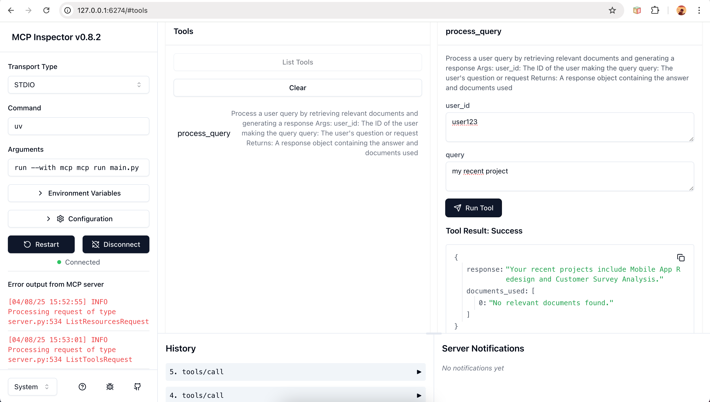

# RAG Application
A Retrieval-Augmented Generation (RAG) application that enhances LLM responses with relevant context.




## Features
- Document retrieval using vector search
- Context-aware prompt generation
- Integration with LLM APIs

## Installation
```
pip install -r requirements.txt
```

## Usage
Connect to the MCP server with Claude Desktop, Cursor, or your preferred IDE.

Use the `process_query` tool to ask questions about the company.

## Configuration
Set up your environment variables in .env:
```
your_api_key
```

## Project Structure
app/retrieval.py: Document retrieval functionality
app/context.py: Context management
app/llm_client.py: LLM API integration
app/prompt_builder.py: Prompt construction

## License
MIT